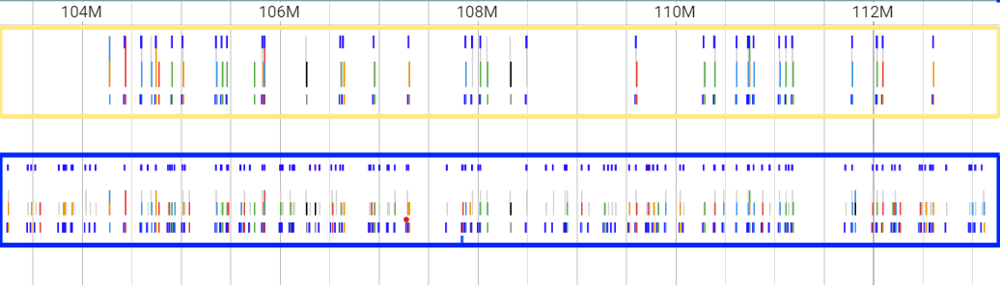

# Abstract
- Overview of the integration of structural variants into VCF files using TogoVar.
- Summary of comparing two workflows: Sarek and NCGM WGS Pipeline.
- Key improvements made: data availability enhancements, addition of pangenome variant calling, and alignment with GA4GH VRS spec. -DAVID

# Introduction

The widespread use of sequencers has generated a flood of data that has greatly faciliated the analysis and understanding of the human genome. Simple variations such as single nucleotide variants (SNVs) and indels have been integrated with the comprehensive Japanese genetic variation database TogoVar, but there is currently no standardized representation for structural variants. Pangenome graphs have also emerged as a powerful tool to integrate multiple haplotypes. To facilitate the integration of structural variants, we developed a Common Workflow Language (CWL) script to add TogoVar information to variant call format (VCF) files. We also compared the .... -DAVID
- **Background**: Overview of genomic sequencing and the importance of structural variant analysis.
- **Problem Statement**: Lack of standardized representation for structural variants and integration challenges.
- **Objective**: To compare workflows for variant calling and integrate structural variant data with TogoVar.

# Methods
## Workflow Comparison
We performed a preliminary comparison of two variant calling workflows: Sarek[@citation:Sarek2020;@citation:Sarek2024] and the pipeline used by the Japanese National Center for Global Health and Medicine (NCGM) for whole genome sequencing (WGS) [@citation:Kawai2023-cw]. Sarek is part of Nextflow's nf-core[@citation:DiTomasso2017;@citation:Ewels2020], a curated set of pipelines built using the Nextflow pipeline language, and can detect germline and somatic variants. For our comparison, we used the Sarek defaults (i.e. the  line in the metro map below copied from [@citation:sareksoftware]) and used the Genome Analysis Toolkit (GATK) HaplotypeCaller[@citation:Poplin2018] to call single nucleotide polymorphisms (SNPs) and indels. 

```{figure} sarek_subway.png
---
height: 150px
name: directive-fig
---
Here is my figure caption!
```
The Japanese NCGM pipeline, on the other hand, is implemented primarily in common workflow language (CWL) [@citation:Crusoe2022] but also contains a Nextflow implementation. We found 
  - **Sarek**: Sarek threw out a sample, one lane -- using fastp throwing a lane image
  - **NCGM WGSPipeline**: Description and usage. [https://docs.nvidia.com/clara/parabricks/latest/documentation/tooldocs/man_haplotypecaller.html]
  - **Comparison**: Differences observed in results, GPU acceleration in NCGM, and differences in read filtering and mapping. Two pileups together image, https://docs.google.com/document/d/1qm3flRa8V0HVKxxC1qdGXTsARqTjOSAwxUtX6MIdCSA/edit quality comparison
  
## Enhancements to TogoVar Data

The molecular annotations for the variants in TogoVar [@togovar2022] are available in TSV format. To improve the data accessibility, we added Tabix indexes by running the following command: `tabix -S1 -s3 -b4 -e4 chr_N_molecular_annotation.tsv.gz`. The third and fourth columns of the TSV file indicate the chromosome number and the start position of each variant on the GRCh38 reference genome, respectively. Additionally, we converted the chromosome representation to start with “chr” to be compatible with the VCF file convention. Finally, we created a CWL pipeline to add TogoVar annotations to VCF files.

## Cactus Pangenome Graph Pipeline Integration

We developed a comprehensive pangenome graph pipeline leveraging the Cactus tools to create robust and flexible pangenome graphs [https://github.com/ComparativeGenomicsToolkit/cactus](https://github.com/ComparativeGenomicsToolkit/cactus). In this work, we utilized MiniCactus to generate the pangenome graph from a single reference genome across multiple samples [https://github.com/ComparativeGenomicsToolkit/cactus/blob/master/doc/pangenome.md](https://github.com/ComparativeGenomicsToolkit/cactus/blob/master/doc/pangenome.md).

 - **Integration:** The pangenome was seamlessly integrated into our variant calling workflow by constructing a pangenome graph that incorporates multiple haplotypes from various samples. This approach enables the identification and analysis of structural variations and other genetic differences that might be overlooked using traditional linear reference-based methods.

 - **Benefits:** Pangenome graphs offer several significant advantages for integrating multiple haplotypes. They provide a more comprehensive view of genomic diversity by representing alternative genetic sequences within the same structure. This is especially beneficial for studying populations with high genetic diversity or capturing structural variations across different individuals. The graph-based approach enhances the accuracy and resolution of variant calling, resulting in more reliable outcomes in genomic studies.

 - **Compatibility:** The graph created in this pipeline is fully compatible with VG tools [https://github.com/vgteam/vg](https://github.com/vgteam/vg), enabling advanced visualization and further analysis. Additionally, if you wish to use a different visualization tool, the .vg file format can be exported and utilized in tools such as SequenceTube for alternative graph visualizations.

**Add citation, did we have an output from it (in slides)?**

 
## Alignment with GA4GH VRS Specification
  - **Specification Overview**: The Variation Representation Specification (VRS) is a GA4GH-approved standard intended to support exchange of genomic variation data between computational systems [@citation:Wagner2021-vr]. VRS provides a terminology and information model that in combination with the decision design of using variants represented as VRS objects (and inheritance) enables users to focus on semantic precision and describe from simple to complex variations in a flexible way. Currently, VRS machine-readable schema is written in YAML ([https://github.com/ga4gh/vrs/blob/2.x/schema/vrs/vrs-source.yaml](https://github.com/ga4gh/vrs/blob/2.x/schema/vrs/vrs-source.yaml)) and implemented in JSON Schema ([https://github.com/ga4gh/vrs/tree/2.x/schema/vrs/json](https://github.com/ga4gh/vrs/tree/2.x/schema/vrs/json)). However, the VRS schema cannot be readily translated to semantic web frameworks since it lacks of this support. Furthermore, there is a lack of recommended ontologies that can be used for more precise semantics and interoperability with the bioinformatics community. To address this issue we modelled an VRS RDF Schema to enable interoperability of using this standard within the semantic web community.
    
  - **Implementation**: We implemented an RDF Schema in ShEx, using OWL ontologies in the OBO Foundry [https://obofoundry.org/](https://obofoundry.org/) such as NCI Thesaurus (NCIT) [https://obofoundry.org/ontology/ncit.html](https://obofoundry.org/ontology/ncit.html), the Semanticscience Integrated Ontology (SIO) [https://github.com/MaastrichtU-IDS/semanticscience](https://github.com/MaastrichtU-IDS/semanticscience), and the Genome Variation Ontology (GVO) [http://genome-variation.org/resource/gvo](http://genome-variation.org/resource/gvo). We based our modelling on the VRS Schema expressed in YAML accessed during the BioHackathon 2024 week, i.e. 25-31 August [https://github.com/ga4gh/vrs/tree/2.x/schema/vrs](https://github.com/ga4gh/vrs/tree/2.x/schema/vrs) and in the design principles currently used to update the GA4GH Phenopackets standard [@citation:Kaliyaperumal_2022]

  - **Schema**: [https://github.com/NuriaQueralt/ga4gh-vrs-rdf-schema.git](https://github.com/NuriaQueralt/ga4gh-vrs-rdf-schema.git)

** UML FROM THE SCHEMA IN THE SLIDES**

# Results
## Workflow Comparison Results - Dorothy
We performed a preliminary comparison between the Sarek and NCGM pipelines on three lanes from GATK's NA12878_20k benchmarking dataset. The Sarek pipeline aligned fewer reads and found fewer variants than the NCGM pipeline. In our initial run, we found that one  In the figure below, we show the CRAM file outputs for both Sarek and 

  - **Variant Calling Performance**: Differences in results between Sarek and NCGM.
  - **Read Filtering and Mapping**: Impact of filtering differences on variant calling accuracy. Dorothy

## TogoVar Data Enhancements
The TogoVar annotation TSV files with modified chromosome representation (chr_N_molecular_annotation.tsv.gz) and their Tabix index files (*.tbi) are available at [https://grch38.togovar.org/downloads/release/current/grch38/annotation/](https://grch38.togovar.org/downloads/release/current/grch38/annotation/). Using these files, users can add the column data from the TSV file to the INFO columns of their own VCF file by running the bcftools annotate command. For example, the following command copies the TogoVar ID (e.g., tgv12345) from the first column of the TSV for chromosome 22 to the INFO/TGV column of the corresponding variant record in a user’s VCF file:
`bcftools annotate -c TGV,-,CHROM,POS,REF,ALT,-,-,-,-,-,-,-,- --annotations chr_22_molecular_annotation.tsv.gz -h annots.hdr users-own.vcf.gz`, where `annots.hdr` includes a VCF header for the INFO/TGV column. Users can easily perform this operation by using the TogoVar Annotation CWL Script, which is available at [https://github.com/yamaken37/BioHackathonFiles2024/tree/main?tab=readme-ov-file#togovar-annotation-cwl-script](https://github.com/yamaken37/BioHackathonFiles2024/tree/main?tab=readme-ov-file#togovar-annotation-cwl-script).

## Cactus Pangenome Graph Pipeline Integration

**Cactus Pangenome Graph Pipeline** is designed to generate a pangenome graph using a single reference genome. This approach allows for the comparison of multiple genomes against a common reference, facilitating the identification of variations and the construction of a unified genomic representation.

How the Pipeline Works
Input Preparation:

- **CSV Input List:**
You need to prepare a list of input genomes in a CSV file. This file should include paths to the genome files and any associated metadata required by the pipeline.
Configuration File (nextflow.config): This file sets up the necessary parameters for the pipeline, including the path to the single reference genome, CPU, memory specifications, and other environment settings.
Pipeline Execution:

The pipeline is executed using the Nextflow workflow manager. It aligns the input genomes against the single reference genome to construct a pangenome graph. The workflow runs within a Docker container, ensuring a consistent environment. Alternatively, Singularity can be used if Docker is not preferred.

- **Output Generation:**
The main output is a pangenome graph built from the alignments of all input genomes to the single reference genome. This graph illustrates how each input genome relates to the reference, highlighting shared sequences and variations.
Additional outputs include alignment files, summary statistics, and logs documenting the pipeline's execution.
Things to Prepare

- **To run this pipeline, ensure you have the following:**
Input CSV File: A list of input genomes in CSV format, properly formatted with the necessary metadata.
Configuration File (nextflow.config): This file should specify the path to the single reference genome, along with CPU, memory allocations, and other relevant parameters.
Container Environment: The pipeline is designed to run within a Docker container, though it can also be adapted for Singularity.
Results

-**Upon completion, the pipeline will produce:**
A pangenome graph showing the relationship between the input genomes and the single reference genome.
Detailed logs and reports outlining the pipeline’s performance, resource usage, and any issues encountered during the process.
This pipeline provides a streamlined approach to constructing a pangenome graph using a single reference genome, making it a valuable tool for genomic comparisons.

## GA4GH VRS Alignment
  - **Compliance**: We aligned our RDF work to the schema in the YAML document [https://github.com/ga4gh/vrs/tree/2.x/schema/vrs](https://github.com/ga4gh/vrs/tree/2.x/schema/vrs) following the guide in the \emph{Machine Readable Specifications} section of the documentation [https://vrs.ga4gh.org/en/stable/schema.html#machine-readable-specifications](https://vrs.ga4gh.org/en/stable/schema.html#machine-readable-specifications). The degree of alignment achieved was 30\% (6 out of 21 objects) with the VRS specification and we followed a top-down approach such as the VRS abstraction itself, where everything rolls up to Variation. In particular, we aligned the following VRS objects: Ga4ghIdentifiableObject, Variation, Expression, MolecularVariation, SystemicVariation and Allele. We used the ShEx inheritance feature to express the VRS object oriented design.

# Discussion
## Implications of Workflow Differences
  - **Accuracy and Efficiency**: How differences in workflows impact variant calling results. - DOROTHY/TAZRO - Do we have the OK of the German group to mention their workflow

## TogoVar Enhancements
We demonstrated that using Tabix indexes with TogoVar annotation TSV files improves data accessibility and performance for TogoVar annotations. In particular, the TogoVar Annotation CWL Script, which utilizes these indexes, can be easily incorporated into user-defined CWLs as a command-line tool. TogoVar contains genomic variants that are not present in public variant databases, such as dbSNP or The Genome Aggregation Database (gnomAD), suggesting that these variants may have been discovered exclusively in Japanese genome studies. By adding TogoVar annotations to users’ VCF files, it becomes possible to provide additional information that cannot be obtained from other public variant databases.


## Cactus Pangenome Graph Pipeline Integration
  - **Integration Benefits**: One of the key advantages of this pipeline is its flexibility and ease of use. The workflow is containerized, ensuring consistency across different computing environments and making it accessible to a wide range of users, regardless of their computational infrastructure. Furthermore, the pipeline’s design allows for future scalability, meaning it can be adapted as new computational tools and methods become available.

While the Cactus Pangenome Graph Pipeline currently generates a pangenome graph using a single reference genome, an area of future improvement is the integration of advanced visualization techniques, such as SequenceTube. SequenceTube offers an interactive way to visualize pangenome graphs, providing a dynamic and engaging method to explore complex genomic data. However, one challenge with SequenceTube is that it requires interactivity, which complicates the process of capturing static images for presentations or publications.

In the future, we aim to enhance this pipeline to include automated visualization through SequenceTube, allowing users to generate and capture high-quality visual representations of their pangenome graphs directly from the workflow. This will not only improve the accessibility and interpretation of the results but also streamline the process of sharing insights with others.

For now, users may need to rely on alternative methods, such as screen recordings or static snapshots, to present their data. Despite this limitation, the pipeline remains a powerful tool for generating pangenome graphs, and the planned improvements will further elevate its utility in genomic research.


## GA4GH VRS Specification
  - **Standardization**: The importance of aligning with VRS is for interoperability with semantic web technologies, frameworks and linked data networks such as the [https://rdfportal.org/](https://rdfportal.org/), the European Joint Programme Rare Diseases Virtual Platform or the SPHN federated health data network, and with tools such as VRSAnnotator ([https://github.com/ohsu-comp-bio/vrs-annotator/tree/main](https://github.com/ohsu-comp-bio/vrs-annotator/tree/main)) for further VCF annotation.

# Conclusion - David
- **Summary**: Recap of findings and improvements made.
- The workflows were added to Dockstore
- **Future Work**: Potential areas for further research and development.

# Acknowledgments
- **Contributors**: Recognition of those who contributed to the work.

Possible CiTO typing annotation include:

* citesAsDataSource: when you point the reader to a source of data which may explain a claim
* usesDataFrom: when you reuse somehow (and elaborate on) the data in the cited entity
* usesMethodIn
* citesAsAuthority
* citesAsEvidence
* citesAsPotentialSolution
* citesAsRecommendedReading
* citesAsRelated
* citesAsSourceDocument
* citesForInformation
* confirms
* documents
* providesDataFor
* obtainsSupportFrom
* discusses
* extends
* agreesWith
* disagreesWith
* updates
* citation: generic citation


## References

**Cactus Pangenome Graph Pipeline Integration**
